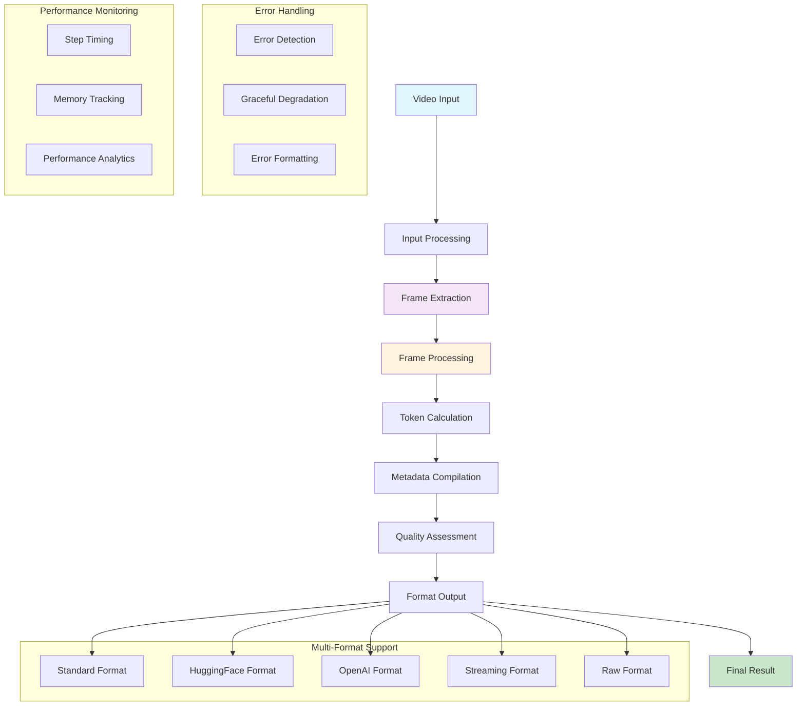

# Video Processor

A comprehensive, model-agnostic video processing pipeline for multimodal AI models with configurable parameters and multiple output formats.

## ✨ Features

- **🔧 Multi-backend Video Reading**: Supports TorchVision, Decord, and TorchCodec with automatic fallback
- **🎯 Smart Frame Sampling**: Intelligent sampling strategies (uniform, adaptive, keyframe, duration-based)
- **📏 Smart Resizing**: Maintains aspect ratios while optimizing for model requirements
- **🧮 Token Calculation**: Estimates token counts and memory requirements for different models
- **📤 Multiple Output Formats**: Standard, HuggingFace, OpenAI, Streaming, and Raw formats
- **⚡ Performance Optimized**: Batch processing, memory management, and async operations

## 🚀 Quick Start

### Installation

```bash
# Clone the repository
git clone <repository-url>
cd video_process

# Install dependencies
pip install -r requirements.txt

# Optional: Install video backends for better performance
pip install decord  # Fast video reading
pip install torchcodec  # FFmpeg-based reading
```

### Basic Usage

```python
from video_processor import VideoProcessor, get_default_config

# Initialize processor
config = get_default_config()
processor = VideoProcessor(config)

# Process a video
result = processor.process("path/to/video.mp4")

print(f"Processed {result.metadata['num_frames']} frames")
print(f"Output shape: {result.frames.shape}")
print(f"Total tokens: {result.token_info['total_tokens']}")
```

### Configuration Examples

```python
from video_processor.config import get_fast_config, get_high_quality_config

# Fast processing (lower quality, higher speed)
fast_config = get_fast_config()
fast_processor = VideoProcessor(fast_config)

# High quality processing
hq_config = get_high_quality_config()
hq_processor = VideoProcessor(hq_config)
```

## 📚 Architecture

The video processor follows a modular pipeline architecture with a complete 8-step processing workflow:

### 🔄 Complete Processing Pipeline



### 📋 Processing Steps

1. **📥 Input Processing** - Validates and normalizes various input formats (files, URLs, base64, frame lists)
2. **🎬 Frame Extraction** - Multi-backend video reading (TorchVision/Decord/TorchCodec) with automatic fallback
3. **🖼️ Frame Processing** - Smart resizing, memory optimization, and quality control
4. **🧮 Token Calculation** - Model-aware token counting and memory estimation
5. **📋 Metadata Compilation** - Comprehensive processing information collection
6. **✨ Quality Assessment** - Advanced frame quality evaluation and optimization recommendations
7. **📤 Format Output** - Multi-format conversion for different frameworks and APIs

### Core Components

- **VideoInputHandler**: Handles various input formats (files, URLs, base64, frame lists)
- **FrameExtractor**: Multi-backend video reading with automatic fallback
- **SmartSampler**: Intelligent frame sampling based on video characteristics  
- **FrameProcessor**: Resizing and preprocessing with memory optimization
- **VideoTokenizer**: Token count calculation and optimization
- **FormatHandler**: Multiple output format support

## 🔧 Configuration

The system uses a comprehensive configuration system:

```python
from video_processor.config import VideoProcessorConfig

config = VideoProcessorConfig()

# Backend configuration
config.backend.priority = ["decord", "torchcodec", "torchvision"]
config.backend.force_backend = "decord"  # Force specific backend

# Sampling configuration  
config.sampling.target_fps = 2.0
config.sampling.max_frames = 64
config.sampling.strategy = "adaptive"

# Processing configuration
config.processing.max_pixels = 1024 * 28 * 28
config.processing.interpolation_mode = "bicubic"
```

## 📤 Output Formats

### Standard Format (Default)
```python
result = processor.process(video, output_format="standard")
# Returns ProcessedVideo dataclass with frames, metadata, timing, token_info
```

### HuggingFace Format
```python
result = processor.process(video, output_format="huggingface")  
# Returns dict compatible with HuggingFace transformers
# Keys: pixel_values, image_grid_thw, video_grid_thw
```

### OpenAI Format
```python
result = processor.process(video, output_format="openai")
# Returns dict with base64 encoded frames for API consumption
```

### Streaming Format
```python
for chunk in processor.process(video, output_format="streaming"):
    # Process video in chunks for large files
    process_chunk(chunk["frames"])
```

## ⚡ Performance Features

### Multi-Backend Support
- **TorchVision**: Reliable, built-in support
- **Decord**: Fastest performance, multi-threading
- **TorchCodec**: Best compatibility, FFmpeg-based

### Memory Optimization
```python
# Optimize for memory constraints
config.optimize_for_memory()

# Estimate memory usage
memory_info = processor.frame_processor.estimate_memory_usage(video_tensor, 224, 224)
print(f"Peak memory: {memory_info['peak_memory_mb']:.1f} MB")
```

## 📊 Token Calculation

The system provides detailed token analysis:

```python
token_info = processor.tokenizer.calculate_tokens(video_tensor, video_config)

print(f"Total tokens: {token_info['total_tokens']}")
print(f"Grid dimensions: {token_info['grid_thw']}")  
print(f"Memory estimate: {token_info['memory_info']['total_memory_mb']:.1f} MB")

# Optimize for token limits
optimized_config = processor.tokenizer.optimize_for_token_limit(
    video_config, target_tokens=4096
)
```

## 🔧 Advanced Usage

### Batch Processing
```python
# Process multiple videos
videos = ["video1.mp4", "video2.mp4", "video3.mp4"]
results = processor.process_batch(videos)

# Batch token calculation
batch_info = processor.tokenizer.calculate_batch_tokens(
    video_tensors, video_configs
)
```

### Custom Sampling Strategies
```python
# Configure adaptive sampling
config.sampling.strategy = "adaptive"
config.sampling.scene_change_threshold = 0.3
config.sampling.short_video_threshold = 10.0

# Duration-based sampling
config.sampling.strategy = "duration"
config.sampling.base_interval = 4.0
```

### Quality Assessment
```python
from video_processor.core.frame_processor import AdvancedFrameProcessor

advanced_processor = AdvancedFrameProcessor(config)
quality_info = advanced_processor.assess_frame_quality(video_tensor)

print(f"Overall quality: {quality_info['overall_quality']:.3f}")
print(f"Sharpness: {quality_info['sharpness']:.3f}")
```

## 🧪 Examples

Run the provided examples:

```bash
# Basic usage example
python video_processor/examples/basic_usage.py

# Backend benchmark (coming soon)
python video_processor/examples/benchmark_backends.py
```

## 🤝 Contributing

1. Fork the repository
2. Create a feature branch (`git checkout -b feature/amazing-feature`)
3. Commit your changes (`git commit -m 'Add amazing feature'`)
4. Push to the branch (`git push origin feature/amazing-feature`)
5. Open a Pull Request

## 📄 License

This project is licensed under the MIT License - see the LICENSE file for details.

## 🙏 Acknowledgments

- Based on Qwen2.5-VL video processing implementation
- Inspired by multimodal AI model requirements

## 📞 Support

- Create an issue for bug reports or feature requests
- Check examples for common usage patterns
- Review configuration options for optimization tips
